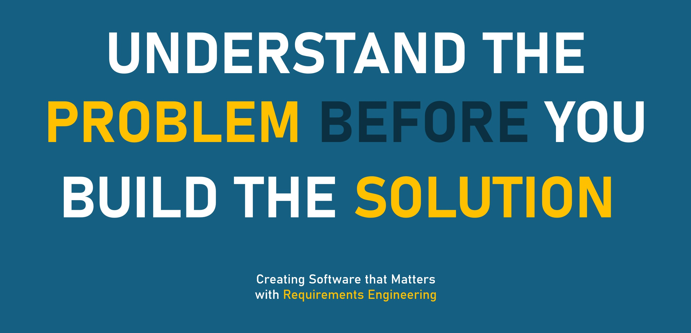

# Requirements Engineering: a brief introduction

[](http://creativecommons.org/licenses/by-nc/4.0)

[](./slides/base/seminar-refun-base.pdf)

**Requirements Engineering: a brief introduction** is a very concise summary of the most important concepts of requirements engineering (RE) and their application. 
It was originally developed as a guest lecture for a software engineering (SE) course to provide Bachelor level students with a general overview of (RE) theory[^1] and techniques.[^2]
The material does not require any prior knowledge about RE, but assumes a basic understanding of SE process models.

## Files

This repository contains the following files.

```
├── figures: additional visual material
│   └── preview.png: opening slide of the main slide deck
├── slides: collection of slide decks for introducing RE
│   └── base: fundamental knowledge and techniques of RE
└── LICENSE.md : license file clarifying reuse of this material
```

The actual presentation files are contained within the subdirectories of the *slides* directory.
Every subdirectory represents one unit.

> [!info]
> Every directory within *slides* contains botha a `.pdf` and `.pptx` version.
> The former is more widely compatible, the latter contains animations and smoother transitions.

## License

**Requirements Engineering: a brief introduction**
© 2023 by [Julian Frattini](https://julianfrattini.github.io/)
is licensed under [CC BY-NC 4.0](LICENSE) 

[^1]: Glinz, M. (2011). [A glossary of requirements engineering terminology. Standard Glossary of the Certified Professional for Requirements Engineering (CPRE) Studies and Exam](https://files.ifi.uzh.ch/rerg/amadeus/publications/various/RE-Glossary_version_1.1b.pdf), Version 1.1b.

[^2]: Méndez Fernández, D., & Penzenstadler, B. (2015). [Artefact-based requirements engineering: the AMDiRE approach](https://link.springer.com/article/10.1007/s00766-014-0206-y). Requirements Engineering, 20, 405-434. DOI: 10.1007/s00766-014-0206-y
